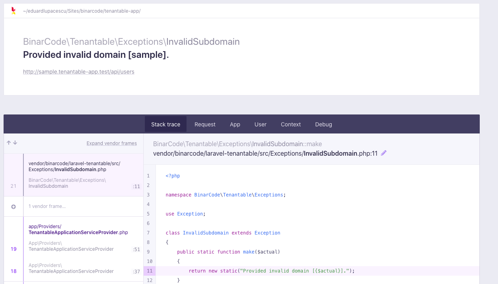
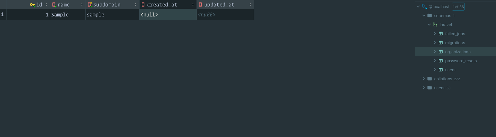
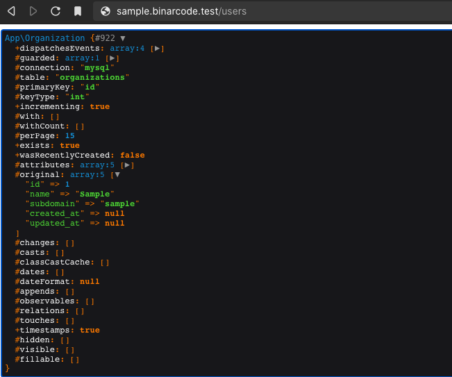

# Installation 1.0

[[toc]]

## What I need?

- Composer
- Laravel Framework 7.0+

## Installing

```bash
composer require binarcode/laravel-tenantable
```

## Setup

```bash
php artisan tenantable:setup
```

:::tip Publish Provider
After publishing the provider from above, make sure you add it into the `config/app.php` file. You can put it in the zone for "Package Service Providers", so we will have the tenant discovered before the `ApplicationServiceProvider` is booted.

```php
/*
 * Package Service Providers...
 */
App\Providers\TenantableApplicationServiceProvider::class,
```
:::

## Configurations

Tenantable will push the configuration file into `config/tenantable.php`. The document is self-explanatory.

What we have to change into a real project? 

### Choose your tenant model

Usually we have the `Organization` model as the `tenant` identifier, so the first change I make into this config:

```php
//config/tenantable.php

/**
 * The name of the table in the database.
 */
'table_name' => 'organizations',

/**
 * The base model for tenant.
 */
'model' => App\Models\Organization::class,
```

Make sure the `Organization` model, implements `Tenantable` interface:

```php
class Organization extends BinarCode\Tenantable\Models\Tenant implements BinarCode\Tenantable\Tenant\Contracts\Tenantable
{
//....
}
```

I highly recommend to extending the `BinarCode\Tenantable\Models\Tenant` so you will don't have to write a lot of methods the Tenantable contract requires, so you will don't have to write a lot of methods the Tenantable contract requries.

### Choose app domain

Then we have to setup the application domain, this will help the Tenantable to identify the tenant. 

```php
//config/tenantable.php

/*
* Domain for the main application
*/
'master_domain' => env('MASTER_DOMAIN', 'sample.test'),

/**
 * Master full qualified name.
 */
'master_fqdn' => env('MASTER_FQDN', 'admin.sample.test'),
```

Let's assume we're using Valet, and we have `binarcode` as the application folder, then the .env configurations will look like:

```dotenv
MASTER_DOMAIN=binarcode.test

MASTER_FQDN=admin.binarcode.test
```
This `MASTER_FQDN` is the fully qualified domain name of the super admin panel. 

Let's assume we are using Laravel Nova, then we will also have this:

```dotenv
NOVA_DOMAIN_NAME=admin.binarcode.test
```

## Single Database

If you're using a single database for the all of your tenants, then in the config file `tenant_database_connection_name` and `master_database_connection_name` should point to the same DB connection, we can use the default `mysql` connection:

```php
// config/tenantable.php

/*
* The connection name to reach the a tenant database.
*
* Set to `null` to use the default connection.
*/
'tenant_database_connection_name' => 'mysql',

/*
 * The connection name to reach the a landlord database
 */
'master_database_connection_name' => 'mysql',
```

Then, in the `created_pipeline` and `deleted_pipeline` we shouldn not create / drop any database when a new tenant is created / deleted, so let's keep these empty: 

```php
// config/tenantable.php

/*
 * This is pipeline list of actions to perform when a new tenant was created
 */
'created_pipeline' => [
    //
],

/*
 * This is pipeline list of actions to perform when a tenant was removed
 */
'deleted_pipeline' => [
    //
],
```

We also don't need any database switching between tenants, so the `activating_pipeline` could look like this:

```php
// config/tenantable.php

/*
 * This is pipeline list of actions when a tenant becomes active
 */
'activating_pipeline' => [
    BinarCode\Tenantable\Tenant\CachePipe::class,
    BinarCode\Tenantable\Tenant\ContainerPipe::class,
    BinarCode\Tenantable\Tenant\AuthGuardPipe::class,
],
```

## Database per tenant

If you want to have a database for each tenant, you can go the other way. Firstly, the connections should be different:


```php
  /*
* The connection name to reach the a tenant database.
*
* Set to `null` to use the default connection.
*/
'tenant_database_connection_name' => 'tenant',

/*
 * The connection name to reach the a landlord database
 */
'master_database_connection_name' => 'master',
```

Now, let's go into the `config/database.php` and make sure we have these 2 connections (tenant and master). You can simply rename the `mysql` connection to `tenant` and duplicate it and give it the name `master`. For the configuration variables you can simply prefix those with `MASTER_`.

Let's see an example:

```php
// config/database.php

'default' => env('DB_CONNECTION', 'tenant'),

   'connections' => [

'tenant' => [
    'driver' => 'mysql',
    'host' => env('DB_HOST', '127.0.0.1'),
    'port' => env('DB_PORT', '3306'),
    // 'database' => env('DB_DATABASE', 'forge'), ! YOU DON'T NEED this line
    'username' => env('DB_USERNAME', 'forge'),
    'password' => env('DB_PASSWORD', ''),
    // ...
],

'master' => [
    'driver' => 'mysql',
    'host' => env('MASTER_HOST', '127.0.0.1'),
    'port' => env('MASTER_PORT', '3306'),
    'database' => env('MASTER_DATABASE', 'forge'),
    'username' => env('MASTER_USERNAME', 'forge'),
    'password' => env('MASTER_PASSWORD', ''),
    // ...
],

// ...
```
As we saw, we don't need the `database` field for the tenant connection, and that's because the tenant will have the database name stored into the master database (along with other tennat information)

The next step would be to make sure we create a database and drop the tenant database when this is created / removed:

```php
// config/tenantable.php

/*
 * This is pipeline list of actions to perform when a new tenant was created
 */
'created_pipeline' => [
    BinarCode\Tenantable\Tenant\DatabaseCreatorPipe::class,
],

/*
 * This is pipeline list of actions to perform when a tenant was removed
 */
'deleted_pipeline' => [
    BinarCode\Tenantable\Tenant\DatabaseDroperPipe::class,
],

/*
 * This is pipeline list of actions when a tenant becomes active
 */
'activating_pipeline' => [
    BinarCode\Tenantable\Tenant\DatabaseSwitchingPipe::class,
    BinarCode\Tenantable\Tenant\CachePipe::class,
    BinarCode\Tenantable\Tenant\ContainerPipe::class,
    BinarCode\Tenantable\Tenant\AuthGuardPipe::class,
],
```


## Tenant detecting

Now since we're almost done, let's test it. 

Let's create a route in our `routes/web.php`: 

```php
Route::get('users', function() {
    dd(tenant());
});
```

And, let's try the route with a test tenant subdmain:

```http request
GET: http://sample.binarcode.test/users
```

You will see probably something like this:



This is because the Tenantable is looking for a tenant, into your organizations table, which presumably has the `subdomain` as being `sample`.

Let's add this organization into the database:



Let's try again:




That's it. Now you have the tenant in the container `tenantable` key. 


### Ways to get current tenant

There are few ways to get the current tenant:

```php
Organization::current();
```

```php
tenant();
```

```php
app(BinarCode\Tenantable\Tenant\Contracts\Tenantable::class)
```

### Check if detected

You can use: `Organization::check()` to detect if there was a tenant detected for the current subdomain.


## Scope queries

Definitely you have to scope all of your tenant models. You can use the `BelongsToTenant` trait for that. What we're doing for our projects, we basically have an `OrganizationModel` or `TenantModel` into our `app/Models` folder:

```php
namespace App\Models;

use Illuminate\Database\Eloquent\Model;
use BinarCode\Tenantable\Models\BelongsToTenant;

class OrganizationModel extends Model
{
    use BelongsToTenant;
}
```

And, all the models that belongs to tenant (or organization) will extend this model, so we are sure - Eloquent will filter automatically entries for the current tenant:

```php
class Transaction extends OrganizationModel
{
}
```


